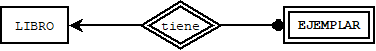
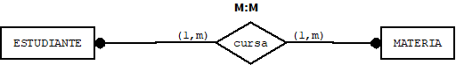

# 1. Diseño conceptual de Bases de datos

El primer paso en el diseño de una base de datos es la recopilación de requisitos,
estos requisitos se detallan generalmente en un documento de requerimientos.
Posteriormente, se realiza un Modelo Entidad/Relación cuya principal característica
es la representación gráfica de alto nivel que refleja la estructura de los datos de
una forma simple e independiente a las tecnologías de modelado de datos.

El diseño conceptual es una descripción concisa de los requisitos de datos por parte
de los usuarios, que nos permite representar la realidad en una forma dirigida al almacenamiento de los datos, para ello se apoya de tres elementos principales; tipos
de entidades, relaciones y restricciones. Dado que esto no incluye detalles sobre la implementación son más fáciles de entender y se pueden utilizar para comunicarse con
los usuarios.

El modelo Entidad/Relación proporciona una visión simple y homogénea de la estructura
de los datos asociados a un proyecto o caso de estudio. Para ello, un modelo
Entidad/Relación se encarga de representar cada uno de los elementos de un modelo de
datos.

Entidades
Atributos
Relaciones entre entidades
Restricciones

El modelo Entidad/Relación actúa como el principal mecanismo de comunicación entre
todos los involucrados en un proyecto de diseño e implementación de una base de datos: 
usuario final, diseñadores, programadores, etc.

## Construcción de modelos ER - Notación Chen

Como se mencionó anteriormente, en el diseño conceptual se crea una representación
gráfica conocida como modelo
entidad relación muy conocido como MER propuesta por Peter Chen en 1976.
A continuación se detallan los elementos del MER así como su representación gráfica.

### 1.1 Tipos de entidades

Una entidad es cualquier objeto real o abstracto con existencia propia acerca del cual queremos almacenar  datos. Las entidades se representan
mediante un rectángulo con el nombre de la entidad en su interior en mayúsculas,
generalmente sustantivos. Algunos ejemplos son; estudiante, profesor, libro, hospital, reservación, curso, historial academico, etc.

Existen entidades llamadas débiles, cuya existencia depende de que exista otra entidad denominada fuerte. Las entidades débiles se representan con doble rectángulo.

Un ejemplo de entidad débil sería ejemplar que es débil respecto a la entidad libro,
ejemplar es débil porque su existencia depende de la entidad libro.

## 1.2 Tipos de atributos

Un atributo es una característica o propiedad que describe una entidad. Por ejemplo,
la entidad alumno puede describirse mediante el nombre, fecha de nacimiento, edad,
domicilio y número de cuenta. A cada uno de los objetos con sus valores particulares obtenidos a partir de la definición de una entidad se le conoce como ejemplar o
instancia de una entidad, es decir, cuando se conocen los valores de cada uno de los atirbutos de una entidad, se genera una instancia. Por otro lado, existen relaciones que también pueden tener atributos.

* Dominio

Donde:
    D es el dominio
    V es el valor
    P es el predicado

Ejemplo: s el valor 'bases de datos' se toma del dominio del atributo
materia que cumpe con el predicado; una de las materias del conjunto ('programación',
ingenieria de software, estructiras discretas, bases de datos).

En el modelo entidad relación se tienen varios tipos de atributos:

* Simple, atributo que no puede subdividirse como la edad, un atributo se representa
con un óvalo con su nombre dentro del mismo y se une a la entidad que representa
mediante una línea.

* Compuesto, se pueden dividir en atributos más pequeños (atributos con significados independientes), como el domicilio ya que se puede subdividir en calle, número colonia
y alcaldía. Gráficamente se crea el atributo y se unen a él mediante una línea los
atributos más pequeños.

* Multivalor, almacena múltiples valores para el mismo atributo, un ejemplo son los
números de teléfonos para un alumno, se utilizan círculos concentricos para
representarlo.

* Derivado o calculado, corresponde a un atributo que puede ser obtenido de otro
atributo de la entidad, como la edad ya que se puede obtener de la fecha de nacimiento.
Un atributo calculado es representado por un círculo discontinuo.

* Opcional, en algunos casos, es posible que una instancia de la entidad no tenga un
valor aplicable para un atributo, por ejemplo, número de hijos para un alumno, para
estos casos se utiliza un atributo opcional. Este atributo es representado por una
línea discontinua.

* Atributo clave, Cada entidad debe definir un atributo clave empleado para
identificar de forma única a cada instancia de la entidad. Se representa subrayando
el nombre del atributo.

* Clave débil, las entidades débiles dependen de la entidad fuerte para ser identificadas, por lo que tienen un atributo que junto con el atributo clave primaria
de su entidad fuerte identifican de manera única a cada ejemplar de la entidad débil,
a este atributo se le llama clave débil o discriminante y se representa subrayando el nombre del atributo con una línea discontinua.

* Clave candidata, en ocasiones una entidad puede tener más de un atributo que puede identificar de manera única a cada ejemplar de la entidad, estos atributos se llaman claves candidatas por ejemplo, rfc y curp en la entidad alumno. Las claves candidatas
se representan de la siguiente forma:

La entidad alumno quedaría representada de la siguiente forma

## 1.3 Relaciones

Con frecuencia las entidades se ligan mediante asociaciones o **relaciones**, que son conexiones o interacciones entre los ejemplares de la entidad. Un alumno se relaciona
con una clase al inscribirse en dicha clase, por ejemplo.

Las relaciones se representan gráficamente con un rombo que incluye
el nombre del tipo de relación en su interior y generalmente son verbos.

Las relaciones cuentan con las siguientes características:

* Grado, es el número de entidades que participan en una relación, una relación de
grado 2 se refiere a la vinculación entre 2 entidades. Las relaciones de grado 1 son relaciones entre la misma entidad y se denominan relaciones unarias, un ejemplo es
cuando los empleados son supervisados por un empleado.

* Tipo de correspondencia, número de ejemplares de una entidad asociados a otro
ejemplar de una entidad. Los tipos son uno a uno (1:1), uno a muchos (1,M) y muchos a muchos (M:M)
* Cardinalidad, se define como el número máximo y mínimo de ejemplares de una entidad
que puede estar relacionada con un ejemplar de la otra entidad. Los valores que pueden tomar son (0,1), (1,1), (0,m) o (1,m), donde m significa muchos ejemplares.

Veamos unos ejemplos:

* Un cliente realiza una o muchas compras, mientras que una compra lo es de un cliente

* Un estado tiene una y solo una capital y una capital lo es de un solo estado

* Un estudiante cursa una o muchas materias y una materia es cursada por uno o muchos estudiantes

* Un empleado es supervisado por otro empleado, por tanto hay empleados que supervisan
a otros.

## Ejemplo

A continuación, se presentan los requisitos de una empresa que requiere dar seguimiento de los
empleados, los departamentos y los proyectos que realizan:

* La empresa está organizada en departamentos. Cada uno tiene un nombre único, un
número único y un
empleado que lo administra. Un departamento tiene varias ubicaciones físicas dentro
de la empresa.

* Cada departamento administra diferentes proyectos, cada uno de los cuales tiene un nombre único, un folio que lo identifica y el costo del mismo.

* Se almacenará el nombre, numero del documento nacional de identidad, el domicilio (calle, número, alcaldía), el sueldo, el sexo, la fecha de nacimiento de cada empleado
y la clave que lo identifica. Un empleado está asignado a un departamento, pero puede trabajar en varios proyectos, que no están administrados necesariamente por el mismo departamento. Se hará un seguimiento del número de horas por semana que un empleado trabaja en cada proyecto. También se realizará el seguimiento del supervisor directo
de cada empleado.

