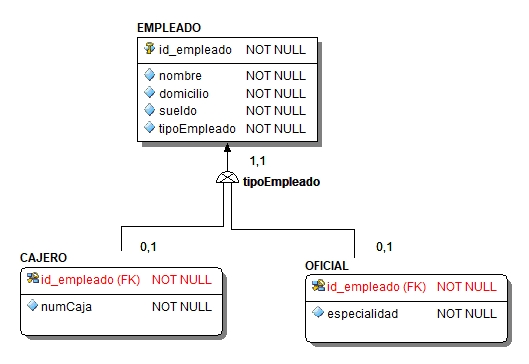
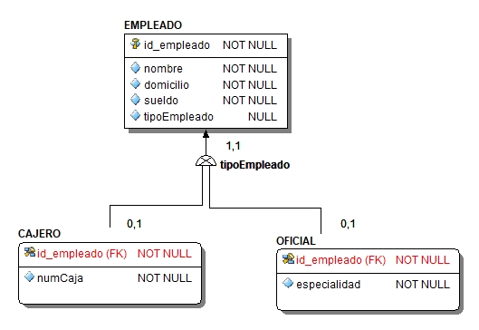
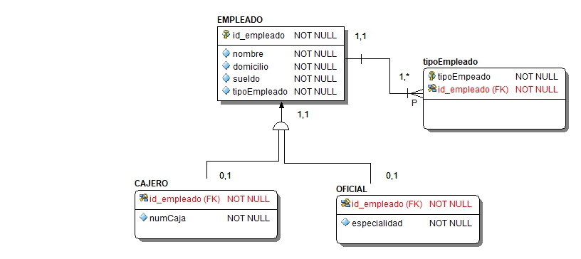
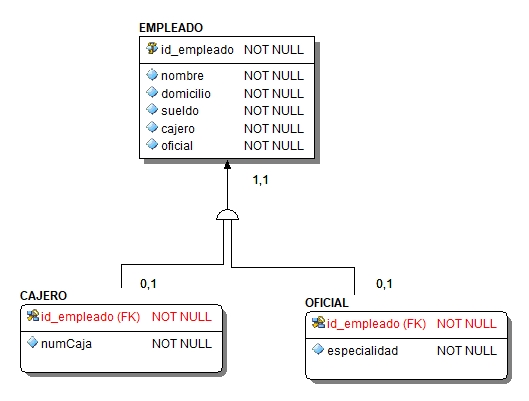
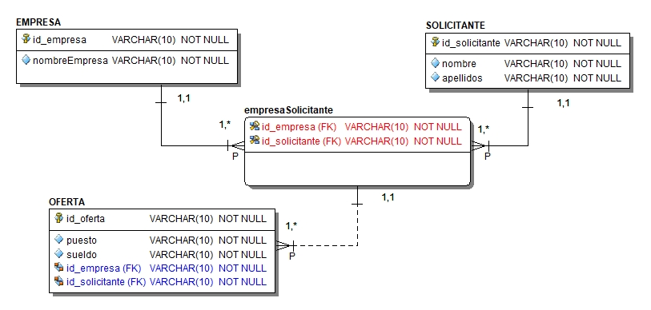

# Diseño lógico avanzado

## Transformación de Jerarquía de tipos

Para cada supertipo y subtipo se crea una tabla, con sus respectivos atributos.

## Exclusividad (disjunta)

* Generalización (traslape total)

El atributo discriminante es obligatorio.

Transformaremos los ejemplos presentados en el modelo entidad-relación.

* Especialización (traslape parcial)

El atributo discriminante es opcional  (admite nulos).

  

## No exclusiva

Si la jerarquía no es exclusividad (solapamiento) pueden darse dos opciones:

a) Crear una tabla con el atributo discriminante que se asocie (relacione) con el
supertipo.

b) Hacer uso de banderas, se crean en el supertipo tantos atributos como suptipos haya.

## Agregación

Se transforma primero la relación interna de la agregación la cual dará lugar a una
nueva tabla, posteriormente se transforma la relaicón de la que participa la agregación.

