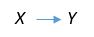

# 2.3 Normalización

La normalización es un proceso que tiene por objetivo reducir los problemas de redundancia
y actualización en las tablas mediante una serie de reglas llamadas formas normales
propuestas por Edgar F. Cood con la aportaciónn de otros investigadores.

## 2.3.1 Dependencias funcionales

Sea R una relación y sean X y Y subconjuntos cualesquiera del conjunto de atributos de R,
entonces podemos decir que Y es dependiente funcionalmente de X, si y sólo si en todo
valor válido posible de R, cada valor X está asociado  con un valor de Y.

  

La parte izquierda de una dependencia funcional DF se denomina determinante y la derecha
dependiente.

### 2.3.1.1 Dependencia parcial

* Puede existir solamente en tablas con llave primaria compuesta.
* Existe dependencia parcial cuando un atributo que es parte de la llave primaria es
determinante de uno o más atributos no clave.

### 2.3.1.2 Dependencia transitiva

* Si un atribto no clave es determiannte de cualquier atributo o atrubtos no clave hay
dependencia transitiva.

### 2.3.1.3 Dependencia multivalor

Si la llave primaria determina multiples valores de 2 o más campos y no hay relación
entre ellos, se dice que hay dependencias multivalor.

## 2.3.2 Primera forma normal (1FN)

Una realación está en primera forma normal 1FN si y solo si:

* Todos sus atributos son atómicos, es decir, si toda tupla contiene exactamente un solo valor para cada atributo.
* No hay grupos de repetición
* La tabla tiene una llave primaria

## 2.3.3 Segunda forma normal (2FN)

Una tabla está en segunda forma normal 2FN si y solo si:

* Está en 1FN
* Se han eliminado todas las dependencias parciales.

## 2.3.4 Tercera Forma Nomal (3FN)

Una tabla está tercera forma normal 3FN si y solo si:

* La tabla está en 2FN
* Ningun atributo no llave es dependiente de otro atributo no llave. Es decir no hay
dependencias transitivas.

## 2.3.5 Cuarta forma normal (4FN)

Una tabla está en cuarta forma normal 4FN si:

* Está en su tercera forma normal 3FN
* No hay dependencias multivalor
