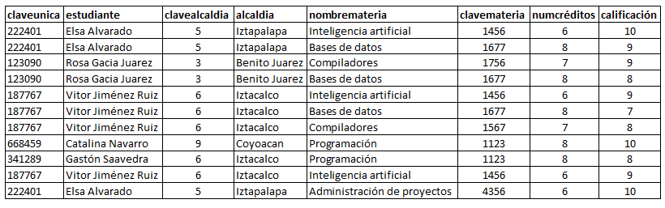
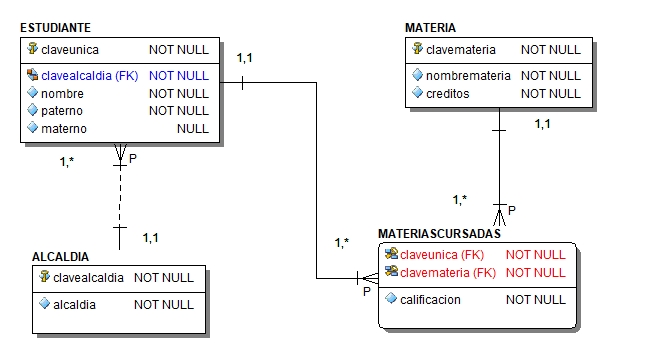
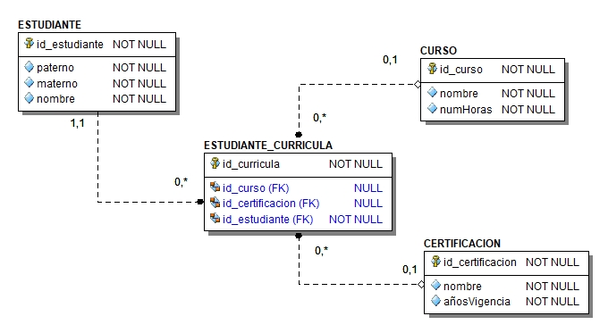
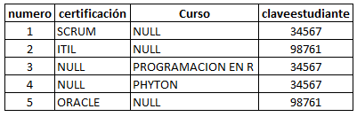
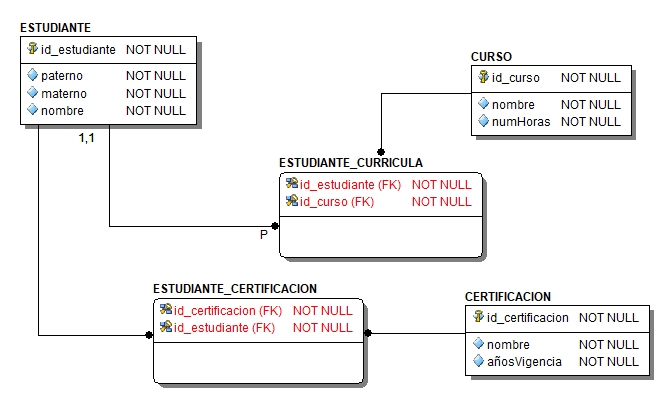

# 2.3 Normalización

La normalización es un proceso que tiene por objetivo reducir los problemas de redundancia
y actualización en las tablas mediante una serie de reglas llamadas formas normales
propuestas por Edgar F. Cood con la aportaciónn de otros investigadores.

## 2.3.1 Dependencias funcionales

Sea R una relación y sean X y Y subconjuntos cualesquiera del conjunto de atributos de R,
entonces podemos decir que Y es dependiente funcionalmente de X, si y sólo si en todo
valor válido posible de R, cada valor X está asociado  con un valor de Y.

<p align="center"></p>

La parte izquierda de una dependencia funcional DF se denomina determinante y la derecha
dependiente.

### 2.3.1.1 Dependencia parcial

* Puede existir solamente en tablas con llave primaria compuesta.
* Existe dependencia parcial cuando un atributo que es parte de la llave primaria es
determinante de uno o más atributos no clave.

### 2.3.1.2 Dependencia transitiva

* Si un atribto no clave es determiannte de cualquier atributo o atrubtos no clave hay
dependencia transitiva.

### 2.3.1.3 Dependencia multivalor

Si la llave primaria determina multiples valores de 2 o más campos y no hay relación
entre ellos, se dice que hay dependencias multivalor.

## 2.3.2 Primera forma normal (1FN)

Una realación está en primera forma normal 1FN si y solo si:

* Todos sus atributos son atómicos, es decir, si toda tupla contiene exactamente un solo
valor para cada atributo.
* No hay grupos de repetición
* La tabla tiene una llave primaria

## 2.3.3 Segunda forma normal (2FN)

Una tabla está en segunda forma normal 2FN si y solo si:

* Está en 1FN
* Se han eliminado todas las dependencias parciales.

## 2.3.4 Tercera Forma Nomal (3FN)

Una tabla está tercera forma normal 3FN si y solo si:

* La tabla está en 2FN
* Ningun atributo no llave es dependiente de otro atributo no llave. Es decir no hay
dependencias transitivas.

## 2.3.5 Cuarta forma normal (4FN)

Una tabla está en cuarta forma normal 4FN si:

* Está en su tercera forma normal 3FN
* No hay dependencias multivalor

### Ejemplo

Dada la siguiente tabla de datos en la cual está registrada la información de las materias
que cursan alumnos y su calificación, normalizaremos hasta la 3FN

<p align="center"></p>

### 1FN

* Observamos que el atributo estudiante no es atómico, entonces lo dividimos en paterno,
materno y nombre
* De acuerdo a la información de la tabla consideramos que no todos los
estudiantes tienen apellido materno por lo cual definimos el atributo como
opcional.
* Obtenemos las dependencias funcionales

```sql
claveunica -> paterno, materno, nombre, alcaldía, colonia
clavemateria -> nombremateria,  numcreditos
clavealcaldia -> alcaldia
claveunica, clavemateria -> calificacion
```

* De acuerdo a las dependencias funcionales determinamos la llave primaria, buscamos al
atributo o atributos que determinan de manera única a cada uno de los atributos de la tabla

```sql
claveunica, clavemateria ->  paterno, materno, nombre, clavealcaldia, alcaldia, clavemateria, nombremateria,  numcreditos calificación
```

* Determinamos el tipo de dependencias:

Las llaves primarias compuestas generan dependencias parciales

`Las dependencias parciales son`

```sql
claveunica -> paterno, materno, nombre, clavealcaldia, alcaldía
clavemateria -> clavemateria, nombremateria,  numcreditos
```

`Dependencias transitivas`

```sql
clavealcaldía -> alcaldia
```

Es dependencia transitiva ya que un atributo que no es parte de la llave primaria
determina a otro atributo que tampoco forma parte de la llave primaria.

### 2FN

* La tabla está en su 1FN
* Eliminamos dependencias parciales

* Por cada dependencia parcial se crea una nueva tabla, en donde el atributo
determinante es la pk de la nueva tabla y sus atributos dependientes atributos de la
tabla
* Se asigna un nombre a las nuevas tablas
* De la tabla base se eliminan solamente los atributos dependientes y los determinantes
se establecen como llaves foráneas fk

Tabla ESTUDIANTE

```sql
claveunica -> paterno, materno, nombre, clavealcaldia, alcaldía
```

Tabla MATERIA

```sql
clavemateria  -> nombremateria, creditos
```

Tabla original MATERIAS_CURSADAS

```sql
claveunica, clavemateria -> calificacion
```

### 3FN

* La tabla está en su segunda forma normal
* Eliminamos dependencias transitivas. Para cada dependencia transitiva se crea
una tabla nueva con su pk y atributos de l atabla origen únicamente se queda el atributo
determinante como fk.

Tabla ALCALDIA

```sql
clavealcaldia -> alcaldía
```

Tabla origen ESTUDIANTE

```sql
claveunica -> paterno, materno, nombre, clavealcaldia
```

La tabla original queda:

El modelo relacional resultante del proceso de normalización es el siguiente

<p align="center"></p>

### Ejemplo 4FN

Revisemos el siguiente modelo relacional que representa una base de datos que
almacena la información de los cursos que ha tomado y las certificaciones de estudiantes.

Considerar las siguientes reglas de negocio:

* Un curso lo toman varios estudiantes, un estudiante puede tomar varios cursos de
preparación.
* Una certificación puede ser adquirida por varios estudiantes, un estudiante puede
obtener varias certificaciones.
* Los cursos de preparación que se ofrecen no se asocian de forma directa con una
certificación, son cursos genéricos que contribuyen con el aprendizaje del estudiante.

<p align="center"></p>

La siguiente imagen muestra un extracto de la información correspondiente a
la tabla ESTUDIANTE_CURRICULA

<p align="center"></p>

En la tabla podemos ver que se asocian a un mismo estudiante tanto certificaciones como
cursos, pero estos campos son independientes. Esto es una dependencia multivalor.

Por otro lado, un mismo estudiante puede generar varios registros de cursos y
certificaciones. Se hace uso de una tabla para almacenar 2 relaciones M:M

Creamos las dos tablas de las relaciones M:M para eliminar la dependencia multivalor
y así tenemos el modelo en su 4FN.

<p align="center"></p>
