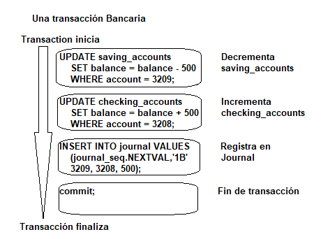

# 5. Manejo y control de transacciones (commit, rollback, propiedades ACID)

## 5.1 Sentencias `commit` y `rollback`

Una transacción se define como un conjunto de operaciones sobre la base de datos.

En Oracle si se ejecuta un conjunto de operaciones y si una de ellas falla se aborta
la transacción entera.

La transacción finaliza cuando se ejecuta un comando de control de transacciones como
`rollback` o `commit`.

## 5.1.1 Ejemplo `commit` y `rollback`

```sql

begin
....

update alumnos set edad=20 where n_alumno=109;
update nuevos set apellido='perez' where n_alumno=200;
commit work;

...

EXCEPTION
   when OTHERS then
      rollback work;
END;

```

Comandos utilizados para el control de transacciones

* `commit`
  
Esta sentencia da por concluida la transacción actual y hace definitivos los cambios realizados
liberando los renglones bloqueados.
Sólo después de que se ejecute commit tendremos acceso a los datos modificados.

* `rollback`
  
Esta sentencia da por concluida la transacción actual y deshace los cambios que se pudiesen
haber producido en la misma, liberando los renglones bloqueados. Se utiliza especialmente
cuando no se puede concluir una transacción porque se han levantado excepciones.

* `savepoint`

Se utiliza para poner marcas o puntos de salvaguarda al procesar transacciones. Se utiliza
junto con rollback permitiendo deshacer cambios hasta los `savepoint`.

El número de `savepoint` esta limitado a 5 por sesión pero lo podemos modificar con la
siguiente sentencia:

```sql
savepoint numero;
```

* `rollback to`

Deshace el trabajo realizado después del punto indicado. Pero no se confirma el trabajo
hecho hasta el savepoint. La transacción no finaliza hasta que se ejecuta una sentencia de
control de transacciones o hasta que finaliza la sesión.

## 5.1.2 Ejemplo `rollback to` y `savepoint`

```sql

create or replace procedure prueba (nfilas number)
as
   begin
      savepoint ninguna;
      insert into tmp values ('primera fila');
      savepoint una;
      insert into tmp values ('segunda fila');
      savepoint dos;
      if nfilas=1 then
         rollback to una;
      else if nfilas=2 then
         rollback to dos;
      else
         rollback to ninguna;
      end if;
      commit;
      exception
         when other then
            rollback
end prueba;

```

## 5.2 Propiedades ACID

Todas las transacciones de Oracle obedecen a las propiedades básicas de una transacción de
base de datos, conocidas como propiedades ACID. ACID es un acrónimo de lo siguiente:

* Atomicidad

    Se realizan todas las tareas de una transacción o ninguna. No hay transacciones
    parciales. Por ejemplo, si una transacción comienza a actualizar 100 filas, pero el
    sistema falla después de 20 actualizaciones, la base de datos revierte los cambios a
    estas 20 filas.

* Consistencia

    La transacción lleva la base de datos de un estado consistente a otro estado
    consistente. Por ejemplo, en una transacción bancaria que debita una cuenta de ahorros
    y acredita una cuenta corriente, una falla no debe causar que la base de datos acredite
    solo una cuenta, lo que daría lugar a datos inconsistentes.

* Aislamiento

    El efecto de una transacción no es visible para otras transacciones hasta que se
    confirma la transacción. Por ejemplo, un usuario que actualiza la tabla empleados no ve
    los cambios no confirmados en los empleados realizados simultáneamente por otro usuario.
    Pero a los usuarios les parece que las transacciones se ejecutan en serie.

* Durabilidad

    Los cambios realizados por transacciones confirmadas son permanentes. Una vez que se
    completa una transacción, la base de datos garantiza a través de sus mecanismos de
    recuperación que los cambios de la transacción no se pierdan.

Para ilustrar el concepto de una transacción, considere una base de datos bancaria.

Cuando un cliente transfiere dinero de una cuenta de ahorros a una cuenta corriente, la
transacción debe constar de tres operaciones separadas:

* Decrementar la cuenta de ahorros

* Incrementar la cuenta corriente

* Registrar la transacción en el diario de transacciones

Oracle Database debe permitir dos situaciones. Si las tres sentencias SQL mantienen las
cuentas en el equilibrio adecuado, los efectos de la transacción se pueden aplicar a la
base de datos. Sin embargo, si un problema como fondos insuficientes, un número de cuenta
no válido o una falla de hardware impide que se completen uno o dos de los extractos de la
transacción, la base de datos debe revertir toda la transacción para que el saldo de todas
las cuentas sea correcto.

El siguiente gráfico ilustra una transacción bancaria. El primer extracto resta $500 de la
cuenta de ahorros 3209. El segundo extracto suma $500 a la cuenta corriente 3208. El tercer
extracto inserta un registro de la transferencia en la tabla del diario. La sentencia final
confirma la transacción.


