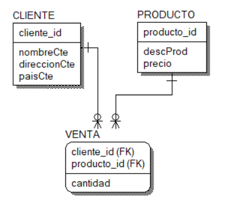

# 6. Lenguaje de Consulta de Datos (DQL)

## 6.2 Álgebra Relacional con SQL

La sintaxis en SQL de los operadores del álgebra relacional se muestra a continuación

### 6.2.1 Operadores básicos

* Selección

```sql
select *
from tabla
where <condición>;
```

Muestra todos los valores de los atributos de la tabla dónde se cumpla la condición
especificada.

* Proyección

```sql
select <columna1>,<columna2>,…,
from tabla;
```

Muestra todos los registro de la tabla correspondientes a los atributos enlistados.

* Unión

```sql
select <columna1>,<columna2>,…,
from tabla1
union <all>
select <columna1>,<columna2>,…,
from tabla2;
```

Realiza una unión en vertical. El comando `all` es opcional y permite ver las tuplas
repetidas que se tienen en ambas relaciones.

* Diferencia

```sql
select <columna1>,<columna2>,…,
from tabla1
minus 
select <columna1>,<columna2>,…,
from tabla2;
```

Muestra los datos de la tabla1 eliminando aquellos que también pertenecen a la tabla2

* Producto Cartesiano

```sql
select <columnaA>,<columnaB>
from tabla1, tabla2;
```

El número de filas resultante será igual al número de registros de la tabla1 multiplicado
por el número de registros de la tabla2, es decir, combina todos los registros de la
tabla1 con todos los registros de la tabla2.

### 6.2.2 Operadores Compuestos

* Intersección

```sql
select <columna1>,<columna2>,…,
from tabla1
instersect
select <columna1>,<columna2>,…,
from tabla2;
```

Muesta como resultado aquellos registros que se encuentren en ambas tablas

* Reunión Natural (join)

En Oracle se tienen las siguientes opciones

```sql
<nombre tabla> natural join <nombre tabla>
<nombre tabla> join <nombre tabla> using (<columna>)
<nombre tabla> join <nombre tabla> on <condición>
```

Con el `natural join` se realiza una unión con todos los campos en común de las relaciones
que se estan operando, estos campos deben tener los mismos nombres para poder realizar la
operación, en caso contrario, el resultado será la realización de un producto cartesiano.

En el `join..using(<columnas>)` permite especificar el campo (o los campos) por el cual
se enlazarán las tablas; los campos de ambas tablas deben tener el mismo nombre y ser de
tipos compatibles.

En el `join..on` se realiza una unión indicándose con la igualación en el `on` los
atributos que deben de considerarse como condición.

Ejemplos:

Considere el siguiente modelo relacional

<p align ="center"></p>

Con base en el modelo anterior y las seguientes datos se realizarán las siguientes
consultas:

* CLIENTE

  |cliente_id|nombreCte|direccionCte|paisCte|
  |----------|---------|------------------|-------|
  |C01|Juan López|Uxmal 35|México|
  |C02|Rita García|Monclovia 17|México|
  |C03|Ricardo Sea|Rivadavia 215|Argentina|
  |C04|Luis Oropeza|Alcalá 19|España
  |C05|Emilio Cruz|Larios 95|España|

* PRODUCTO

  |procuto_id|descProducto|precio|
  |----------|------------|------|
  |P01|lampara de mesa|1500|
  |P02|candelabro|2000|
  |P03|mesa de centro|1300|
  |P04|silla mecedora|2950|
  |P05|esquinero| 12501

* VENTA

  |cliente_id|producto_id|cantidad|
  |----------|-----------|-------|
  |C01|P01|1|
  |C02|P01|2|
  |C02|P02|3|
  |C05|P01|2|

1. Nombre de los clientes del país México. En este ejemplo observamos el uso de los
operadores unarios.

   ```sql
   select nombreCte
   from cliente
   where paisCte='México';
   ```

   |nombreCte|
   |----------|
   |Juan López|
   |Rita García|

2. Nombre de los clientes, descripción y cantidad de los productos comprados. En este
ejemplo observamos la utilización del producto cartesiano, con la condición de igualdad
de atributos.

   ```sql
   select nombreCte,descProd,cantidad
   from cliente,venta,producto
   where cliente.cliente_id=venta.cliente_id
   and venta.producto_id=producto.producto_id;
   ```

   |nombreCte|descProducto|cantidad|
   |----------|---------|----------|
   |Juan López|lampara de mesa|1|
   |Rita García|lampara de mesa|2|
   |Rita García|candelabro|3|
   |Emilio Cruz|lampara de mesa|2|

   Podemos obtener el mismo resultado utilizando `natural join` como se muestra a
   continuación

   ```sql
   select nombreCte,descProd,cantidad
   from cliente
   natural join venta
   natural join producto;
   ```

   |nombreCte|descProducto|cantidad|
   |----------|---------|----------|
   |Juan López|lampara de mesa|1|
   |Rita García|lampara de mesa|2|
   |Rita García|candelabro|3|
   |Emilio Cruz|lampara de mesa|2|

3. Clientes que no han comprado ningún producto. En este ejemplo se observa el uso del
operador diferencia (`minus`) y el operador `join..on`.

   ```sql
   select nombreCte
   from cliente
   minus
   select nombreCte
   from cliente c
   join venta v
   on c.cliente_id=v.cliente_id;
   ```

   |nombreCte|
   |----------|
   |Ricardo Sea|
   |Luis Oropeza|

4. Descripción de los productos que no se han vendido en México. En este ejemplo se
observa el uso del `join..using` y el operador diferencia (`minus`).

   ```sql
   select descProd
   from producto
   minus
   select descProd
   from producto
   join venta using(producto_id)
   join cliente using(cliente_id)
   where paisCte='México';
   ```

   |descProducto|
   |------------|
   |lampara de mesa|
   |candelabro|
   |mesa de centro|
   |silla mecedora|

5. Descripción de los productos que fueron comprados por clientes mexicanos y españoles.
En este ejemplo se observa el uso del operador intersección (`intersect`), se mostrará
como resultado la descripción de todos aquellas productos que coincidan en ambas
consultas.

   ```sql
   select descProd
   from producto
   join venta using(producto_id)
   join cliente using(cliente_id)
   where paisCte='México'
   intersect
   select descProd
   from producto
   join venta using(producto_id)
   join cliente using(cliente_id)
   where paisCte='España';
   ```

   |descProducto|
   |------------|
   |lampara de mesa|

6. Descripción de los productos que fueron comprados por clientes mexicanos o clientes
españoles. En este ejemplo se muestra el uso del operador unión; se mostrará como
resultado la unión vertical de la descripción de los productos que se tienen en ambas
relaciones.

   ```sql
   select descProd
   from producto
   join venta using(producto_id)
   join cliente using(cliente_id)
   where paisCte='México'
   union
   select descProd
   from producto
   join venta using(producto_id)
   join cliente using(cliente_id)
   where paisCte='España';
   ```

   |descProducto|
   |------------|
   |lampara de mesa|
   |candelabro|
  
   Si deseamos ver los productos que se encuentran en ambas consultas al mismo tiempo
   utilizamos en operador `all` de la unión.

   ```sql
   select descProd, paisCte
   from producto
   join venta using(producto_id)
   join cliente using(cliente_id)
   where paisCte='México'
   union all
   select descProd, paisCte
   from producto
   join venta using(producto_id)
   join cliente using(cliente_id)
   where paisCte='España';
   ```

   |descProducto|paisCte|
   |------------|--------|
   |lampara de mesa|México|
   |lampara de mesa|México|
   |candelabro|México|
   |lampara de mesa|España|
