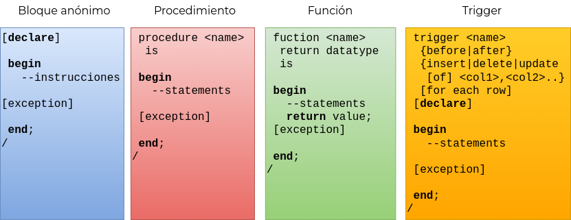

# 7 Fundamentos - Programación PL/SQL

## 7.1 Introducción

PL/SQL (Procedural Language extension to SQL)  es una extensión del lenguaje SQL para la
base de datos Oracle.  La extensión incluye diversos elementos que a nivel general, no se
incluyen en el estándar SQL.

<p align="center"></p>

PL/SQL permite escribir código que se ejecuta justo donde se encuentran los datos,
permitiendo un alto rendimiento en comparación con otros lenguajes que se ejecutan fuera
de la base de datos.

Principales elementos adicionales:

* Variables, constantes, tipos de datos.
* Estructuras de control: LOOPS, IF, ELSE, etc.
* Unidades o piezas de código PL/SQL reutilizables (escritas 1 vez, ejecutadas N veces)
* Características como encapsulamiento de datos, manejo de excepciones, ocultamiento de
  información, programación orientada a objetos, etc.

Cada programa PL/SQL puede contener uno o más **bloques de código** que pueden estar
anidados.

## 7.2 Elementos básicos de un programa PL/SQL

```sql
--sección declarativa (opcional)
[declare]

--órdenes sql y pl/sql (obligatorio)
begin 
  <instrucciones pl/sql>

--excepciones (opcional)
[exception] 

--fin de bloque (obligatorio)
end;
/
```

* En la sintaxis anterior se muestran 3 bloques: `declare`, `begin` y `exception`.
* Observar que la cláusula `end` termina con “;” que indica el fin del bloque `begin`.
* El carácter “/” provoca que el bloque de código sea ejecutado.
* Todas las sentencias que se encuentran dentro de un bloque, declaraciones y las
  instrucciones que indican el fin de un bloque deben terminar con “;”
* Dentro del cuerpo del bloque (posterior a la instrucción `begin`) debe existir al
  menos una instrucción. El siguiente ejemplo muestra el programa PL/SQL más simple que
  puede escribirse:

```sql
begin
  null;
end;
/
```

## 7.3 Principales objetos PL/SQL

* Bloques anónimos
* Procedimientos
* Funciones
* Triggers

<p align="center"></p>

### Bloques anónimos

No contienen un nombre. No son almacenados en el diccionario de la base de datos. Al no
ser almacenados, se compilan y se ejecutan cada vez que se requieran durante la ejecución
de alguna aplicación.

### Procedimientos

Son objetos con nombre almacenados en el diccionario de la base de datos. No requieren ser
re-compilados cada vez que se deseen ejecutar. No regresa un valor como en el caso de una
función, pero soporta parámetros de entrada y salida que pueden simular retorno de
múltiples valores a través del uso de variables de salida. Pueden actualizar el estado de
la base de datos, modificar datos, etc.

### Funciones

Las funciones son similares a un procedimiento almacenado con algunas diferencias:

* Una función regresa un valor de un determinado tipo de dato.
* Las funciones no deben alterar o modificar el estado de la base de datos ni
  los datos.
* Una función debe trabajar únicamente con los parámetros que recibe.

### Triggers

Se compilan y se almacenan en el diccionario de datos. Se activan al ocurrir un evento por
lo que no aceptan ningún tipo de parámetro, no regresan algún valor.

### Otros objetos PL/SQL

* Paquetes (spec y body)
* Tipos de datos personalizados
* Colecciones
* Excepciones

### Ejemplo - Hola Mundo con PL/SQL

```sql
set serveroutput on
begin
  dbms_output.put_line('Hola mundo!, fecha actual: '|| sysdate);
end;
/

```

`serveroutput` es una variable de ambiente de SQL*Plus que habilita la salida de mensajes a
consola a través del uso de un buffer. De no activarse, los mensajes no se imprimirán en
la consola.

Para los ejemplos de este tema, considerar el siguiente modelo relacional de un
colegio empleado para llevar el control de las inscripciones de sus alumnos.

<p align="center"></p>

## 7.4 Variables, asignaciones y operadores

Los tipos de datos que se emplean para declarar variables en un programa PL/SQL están
integrados por los siguientes grupos:

* Todos los tipos de datos SQL.
* Tipos de datos particulares o específicos de PL/SQL.

El alcance de una variable es local. Esto significa que una variable será visible
únicamente en el bloque PL/SQL donde fue declarada.

Sintaxis

```sql
<identifier> [constant] <datatype> [not null] [:= | default <expression>];
```

### Ejemplo - declaración de variables

```sql
set serveroutput on
declare
  v_uno number;
  v_dos number := 2;
  v_tres number not null  := 3;
  v_cuatro number default 4;
  v_str varchar2(50);
begin
  v_uno := 1;
  v_str := v_uno||','||v_dos||','||v_tres||','||v_cuatro;
  dbms_output.put_line(v_str);
end;
/

```

* Observar el operador :=  empleado para asignar un valor inicial a las variables.
* Es posible emplear `not null` para garantizar que la variable no puede tener valores nulos
  (requiere asignar valor inicial).
* De forma equivalente se puede emplear `default` para inicializar una variable.

### 7.4.1 Otras formas para definir variables

El atributo `%type` permite hacer referencia a una columna de una tabla o una variable que
se haya definido anteriormente. Su sintaxis es:

```sql
nombreVariable  tabla.columna%type; 

```

El tipo de dato de la variable corresponde con el tipo de dato de la columna que pertenece
a la tabla especificada.

#### Ejemplo - declarar variales con tipos de datos de columnas

```sql
v_nombre empleado.nombre%type;
v_balance number; 

```

Es posible hacer referencia a un renglón de una tabla o cursor, con el fin de crear
variables que permitan acceder a todos los atributos o columnas de dicho
renglón. para ello se emplea %rowtype. Su sintaxis es:

```sql
nombrevariable {tabla | cursor}%rowtype;

```

#### Ejemplo - variables `rowtype`

```sql
v_estudiante  estudiante%rowtype;
. . .
dbms_output.put_line('nombre del estudiante' || v_estudiante.nombre);

```

En este ejemplo, la variable `v_estudiante` es de tipo `rowtype` y se emplea para acceder
a los atributos del registro, por ejemplo para acceder a la columna nombre del estudiante.

#### Ejemplo - consulta de plan de estudios

Crear un Script PL/SQL que muestre en consola los datos del plan de estudios con id =1

```sql
declare
  v_id plan_estudios.plan_estudios_id%type;
  v_clave plan_estudios.clave%type;
  v_fecha plan_estudios.fecha_inicio%type;

begin
  select plan_estudios_id,clave,fecha_inicio 
  into v_id,v_clave,v_fecha 
  from  plan_estudios 
  where plan_estudios_id=1;
 
  dbms_output.put_line('id:    '||v_id);
  dbms_output.put_line('clave: '||v_clave);
  dbms_output.put_line('fecha: '||v_fecha);
end;
/
```

* Observar el tipo de dato asignado a cada variable.  Se hace corresponder con el tipo de
  dato asignado en la tabla. Se recomienda esta técnica de ser posible para evitar
  conflicto de tipos de datos.
* Observar el uso de la instrucción `into`. En PL/SQL el resultado de una instrucción
  `select` debe ser asignado a una variable, o de lo contrario el programa no compilará.
  En este caso, se obtienen 3 columnas, se emplean las variables `v_id`,  `v_clave` y
  `v_fecha` para almacenar  los valores correspondientes.
* Observar que esta sentencia SQL solo regresa un registro. Esto es un requisito ya que
  las variables antes mencionadas sólo pueden referenciar un solo valor a la vez.
* Otra restricción es que la sentencia no debe regresar 0 registros. Esto se debe a que
  las variables deben ser inicializadas.
* Para situaciones en las que la sentencia `select` obtiene 0 registros o más de un
  registro, la técnica cambia. Se hace uso de un cursor en lugar de la instrucción `into`.
  Este concepto se revisará más adelante.

### 7.4.2 Convenciones para el nombrado de variables

Estructura PL/SQL| Convención
---------|----------
 Variable | `v_variable_name`
 Constante | `c_constant_name`
 Parámetro en un subprograma | `p_param_name`
 Cursor | `cur_cursor_name`
 Excepción | `e_exception_type`

## 7.5 Estructuras de iteración

PL/SQL soporta 3 estructuras de iteración:

* For Loops.
* Simple Loops.
* While Loops.

### 7.5.1 For loops

Generalmente un for loop se emplea para recorrer cursores, pero también se pueden emplear
para otros propósitos empleando un For numérico (iteración por rango de valores).

Sintaxis For numérico:

```sql
for i in starting_number .. ending_number  loop
  <statements>
end loop;
```

Ejemplo:

```sql
begin
  for v_index in 1 .. 10 loop
    dbms_output.put_line('Iterando : '||v_index);
    if v_index >= 5 then
      dbms_output.put_line('terminando prematuramente');
      exit;
    end if;
    if v_index = 2 then
      dbms_output.put_line('El siguiente numero sera el 3');
      continue;
    end if;
  end loop;
end;
/

```

* Observar el uso de `exit` y `continue`. Corresponden con las instrucciones `break` y
  `continue` que comúnmente se emplean en otros lenguajes de programación.
* El uso de Simple Loops y su uso con cursores se explica más adelante.

### 7.5.2 Cursores

Hasta este momento, en todos los ejemplos PL/SQL la instrucción select no devuelve más de
un registro. Si deseamos obtener más de un valor se requiere hacer uso de un cursor
explícito para extraer individualmente cada fila.

Un cursor es un área de memoria privada utilizada para realizar operaciones con los
registros devueltos tras ejecutar una sentencia select. Existen dos tipos:

* Implícitos.
  * Creados y administrados internamente por el manejador para procesar sentencias SQL.
* Explícitos.
  * Declarados explícitamente por el programador.

Existen 2 técnicas para realizar el manejo de cursores:

* Simple loop:  El control del ciclo de vida del cursor se debe realizar en el programa:
  abrir el cursor `open <cursor>`,  obtener cada renglón: `fetch <cursor> into <variable>`,
  cerrar el cursor al terminar de iterar  `close <cursor>`
* For loop:  El control del ciclo de vida del cursor se hace de forma implicita a través
  de un for especial llamado **for loop**. El programa no requiere el manejo explicito
  de las instrucciones anteriores.

#### Ejemplo - uso de cursores

Construir un script que imprima el nombre, apellidos, nombre de la asignatura y el número
de cursos que imparte cada profesor de la universidad.  Emplear tanto un simple loop como
un for loop

##### Simple loop

```sql
declare
  --declaración del cursor
  cursor cur_datos_profesor is
  select p.nombre,p.apellido_paterno, p.apellido_materno,
    a.nombre, count(*) cursos
  from profesor p, curso c, asignatura a 
  where p.profesor_id=c.profesor_id 
  and c.asignatura_id = a.asignatura_id 
  group by p.nombre,p.apellido_paterno,p.apellido_materno,a.nombre;
 
  --declaración de variables 
  v_nombre profesor.nombre%type;
  v_ap_pat profesor.apellido_paterno%type;
  v_ap_mat profesor.apellido_materno%type;
  v_asignatura asignatura.nombre%type;
  v_num_cursos number;
 
begin
 open cur_datos_profesor;
 dbms_output.put_line('resultados obtenidos');
 dbms_output.put_line(
    'nombre  apellido paterno apellido materno  asignatura #cursos');
 loop 
    fetch cur_datos_profesor into 
      v_nombre,v_ap_pat,v_ap_mat,v_asignatura,v_num_cursos;
    exit  when cur_datos_profesor%notfound;
    dbms_output.put_line(
      v_nombre||' , '||v_ap_pat||' , '||v_ap_mat
      ||' , '||v_asignatura||' , '||v_num_cursos); 
  end loop;
  --Importante: Cerrar el cursor al terminar para liberar recursos.
  close cur_datos_profesor;
end;
/

```

##### For loop

El siguiente código realiza exactamente la misma funcionalidad, pero ahora de forma
más compacta y simple a través del uso de un for loop

```sql
set serveroutput on
declare
  --declaración del cursor
 cursor cur_datos_profesor is
 select p.nombre as nombre_profesor,p.apellido_paterno, p.apellido_materno,
    a.nombre as nombre_asignatura, count(*) cursos
 from profesor p, curso c, asignatura a
 where p.profesor_id=c.profesor_id
 and c.asignatura_id = a.asignatura_id
 group by p.nombre,p.apellido_paterno,p.apellido_materno,a.nombre;
begin
 dbms_output.put_line('resultados obtenidos');
 dbms_output.put_line(
    'nombre  apellido paterno apellido materno  asignatura #cursos');
 for p in cur_datos_profesor loop
    dbms_output.put_line(
      p.nombre_profesor||' , '||p.apellido_paterno
      ||' , '||p.apellido_materno
      ||' , '||p.nombre_asignatura||' , '||p.cursos);
  end loop;
end;
/
```

* Observar que ya no fue necesario declarar variables respecto al primer ejemplo.
* Observar el uso de un For Loop. La variable `‘p’` representa a cada uno de los renglones
  que obtiene el cursor.  Por lo tanto, para acceder a los valores de las columnas se
  puede emplear la sintaxis `p.<nombre_columna>` como se muestra en el código. Esto
  permite eliminar la necesidad de declarar variables para cada columna y el uso de la
  instrucción `fetch`. El For loop se encarga de ello.
* Sin embargo, se debe tener cuidado con los nombres de las columnas. En este ejemplo
  existen 2 columnas llamadas `‘nombre’` que corresponden al nombre del profesor y al
  nombre de la asignatura. En este caso se debe especificar un alias a cada columna para
  evitar ambigüedades (observar los alias asignados para las columnas `nombre_profesor` y
  `nombre_asignatura`).
* Finalmente, observar que ya no fue necesario abrir y cerrar el cursor. Este proceso
  también es manejado por el For Loop.
