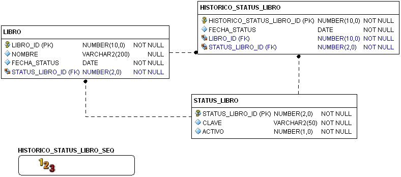

# 7 Fundamentos - Programación PL/SQL

## 7.6 Triggers

* Un trigger (disparador) es un programa PL/SQL que se almacena en la base de datos.  Su
  principal diferencia con respecto a otros programas como procedimientos o funciones, es
  que un trigger no puede ser invocado por el programador o usuario, más bien, los
  triggers se ejecutan cuando ocurre un evento en la base de datos, por ejemplo:
  eventos DML (inserciones, actualizaciones, eliminaciones de datos), eventos a
  nivel base de datos: crear un usuario, eliminar un usuario, etc.
* El usuario que desee crear un trigger deberá contar con el privilegio `create trigger``.

### 7.6.1 DML Triggers

Representan el tipo de trigger más común y usado. El trigger se ejecuta cuando se realiza
una operación `insert`, `update` o `delete` sobre un dato que pertenece a una tabla.  El
trigger se asocia a la tabla (no a los datos). En esta categoría un trigger puede ser
útil para:

* Auditoría (monitorear y controlar quién y cuándo se modifica un dato).
* Respaldar datos antes que estos sean modificados o eliminados.
* Asignación automática de valores para llaves primarias.
* Implementar reglas de negocio o restricciones complejas que deben ser validadas al
  ocurrir o aplicar un cambio a los datos.

El trigger se dispara cuando ocurre alguno de los siguientes eventos:

* Antes de ejecutar la sentencia DML que provoca la activación del trigger, conocido como
  **before statement** trigger o **statement-level before** trigger.
* Después de ejecutar la sentencia DML que provoca la activación del trigger, conocido
  como **after statement** trigger o **statement-level after** trigger.
* Antes de aplicar la operación DML a cada uno de los registros afectados por la sentencia
  que provoca la activación del trigger, conocido como **before each row** trigger o
  **row-level before** trigger. Notar que el trigger se dispara por cada registro
  afectado.
* Después de aplicar la operación DML a cada uno de los registros afectados por la
  sentencia que provoca la activación del trigger, conocido como **after each row**
  trigger o **row-level after** trigger.

#### 7.6.1.1 Pseudorecords :new, :old

Las variables `:new` y `:old`  aplican para triggers de tipo **for each row**. Sus valores
apuntan al registro que provocó el evento, por ejemplo, el registro que se está insertando,
modificando o eliminando. Sus valores dependen de tipo de operación DML:

`insert`

* `:new` apuntan al registro que se va a insertar o al registro que se acaba de insertar
* `:old`  siempre tendrá un valor nulo ya que no existe registro viejo a insertar

`delete`

* `:old` apuntan al registro que se va a eliminar o al registro que se acaba de eliminar
* `:new`  siempre tendrá un valor nulo ya que no existe registro nuevo a eliminar

`update`

* `:new` apunta al registro con los valores nuevos, actualizados por la sentencia update
* `:old` apunta al registro con los valores viejos, es decir, antes de ser modificados por
  la sentencia update.

##### Ejemplo - Histórico

Generar un trigger, de tal forma que al crear o al modificar el status de un libro, se
genere un registro en su histórico.

<p align="center"></p>

```sql
create or replace trigger hist_status_trigger
  after insert or update of status_libro_id on libro
  for each row
  declare
  v_status_id number(2,0);
  v_fecha_status date;
  v_hist_id number(10,0);
  v_libro_id number(10,0);
  begin
    -- obtiene el consecutivo de la secuencia
    select historico_status_libro_seq.nextval into v_hist_id from dual;

    --asigna valores a las variables con el nuevo status y fecha
    v_status_id := :new.status_libro_id;
    v_fecha_status := :new.fecha_status;
    v_libro_id := :new.libro_id;

    dbms_output.put_line('status anterior: '|| :old.status_libro_id);
    dbms_output.put_line('status nuevo: '|| :new.status_libro_id);

    dbms_output.put_line('insertando en historico, libro_id: '
      || v_libro_id ||', status_id: ' || v_status_id
      ||', fecha: '|| v_fecha_status||', hist_id: '||v_hist_id);

    -- inserta en el histórico

    insert into historico_status_libro
     (historico_status_libro_id,status_libro_id,fecha_status,libro_id)
    values(v_hist_id,v_status_id,v_fecha_status,v_libro_id);
  end;
```

* Observar el uso de la variable :new empleada para obtener los valores del
  registro que se está actualizando o que se está agregando. A partir de los
  valores obtenidos se realiza la inserción en `historico_status_libro`.

#### 7.6.1.2 Predicados condicionales

Permiten identificar en el código del trigger el evento particular que provocó su
activación. Por ejemplo, determinar si el evento fue una operación `insert`, `update`,
`delete`, e inclusive saber qué columna fue actualizada en el caso de una operación
`update`.

Para identificar el evento se emplean los siguientes predicados condicionales:

* Inserting:  El trigger fue activado por una operación de inserción.
* Updating:  El trigger fue activado por una operación de actualización.
* Updating(`‘<nombre_columna>’`) El trigger fue activado al actualizar una determinada
  columna.
* Deleting: El trigger fue activado por una operación de eliminación.

##### Ejemplo

```sql
create or replace trigger t
  before
    insert or
    update of nombre, status_libro_id or
    delete
  on libro
begin
  case
    when inserting then
      dbms_output.put_line('insertando libro');
    when updating('nombre') then
      dbms_output.put_line('Actualizando el nombre');
    when updating('status_libro_id') then
      dbms_output.put_line('Actualizando status');
    when deleting then
      dbms_output.put_line('Eliminando');
  end case;
end;
/
```
