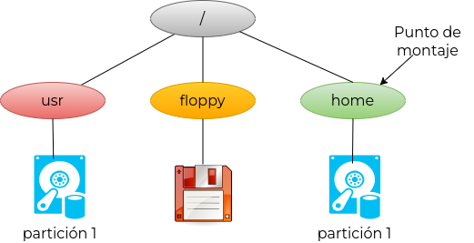
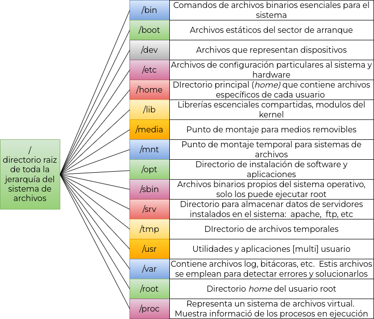

# 8. Fundamentos de Linux

## 8.4 Sistema de archivos - navegación  y exploración

Una de las habilidades fundamentales en Linux es saber manejar, navegar y
manipular el sistema de archivos del sistema operativo.

Un concepto importante es que en UNIX/Linux, todo es considerado como un **archivo**. El
kernel es un conjunto de archivos, las librerías son archivos, un directorio es un
archivo, un comando es un archivo, un disco duro es un archivo, etc.

Los archivos se pueden clasificar en 3 grupos:

1. Archivos ordinarios: contienen información, como programas, imágenes, texto, etc.
2. Directorios: Los directorios son simplemente archivos cuyo contenido es la
   relación de los archivos y directorios que hay en su interior.
3. Archivos especiales: son los archivos que representan a los dispositivos de
   hardware como la impresora, el disco, etc.

GNU/Linux soporta varios tipos de sistemas de archivos:

* `EXT2`: es el sistema de archivos nativo de GNU/Linux.
* `EXT`3: es una modificación del `ext2` para añadirle funcionalidades de journaling.
* `EXT`4: mejora del ext3.
* `VFAT`: este tipo permite utilizar sistemas de archivos de Windows (FAT, FAT32).
* `NTFS`: otro sistema de archivos de los sistemas Windows.
* `Iso9660`: es el sistema de archivos estándar para CD-ROM y DVD.
* `NFS`: sistema de archivos en red que permite compartir sistemas de archivos
   entre diferentes máquinas conectadas en red y tratarlos de forma local.

### 8.4.1 Montaje de un sistema de archivos

Antes de poder utilizar un sistema de archivos contenido en una partición de un
disco, este debe ser montado. A diferencia de otros sistemas operativos y como
cualquier UNIX, GNU/Linux emplea una jerarquía de directorios o árbol de directorios
único. Cuando un sistema de archivos es montado, su contenido aparece como si
fueran simples subdirectorios asociados a otro sistema de archivos ya montado.

Por ejemplo, el sistema de archivos principal `/` fue ya montado. Una partición
contiene el sistema de archivos `/home`. Al ser montado, este sistema de archivos
será asociado al sistema de archivos principal `/`. De esta forma cuando un usuario
se cambia al directorio `/home`, pareciera que el contenido de la carpeta home
pertenece al sistema de archivos principal `/`.  Al final se obtiene un solo árbol

<p align="center"></p>

El siguiente ejemplo muestra la forma en la que se realiza el montaje de una
partición

```bash
# mount -t vfat /dev/sdb1 /mnt
```

* La opción `-t` indica el tipo de formato, en este caso `vfat`
* El primer parámetro `/dev/sdb1` Corresponde con el dispositivo que contiene
  la partición. Esta partición contiene al sistema de archivos a montar.
* El segundo parámetro indica el directorio donde se realizará el montaje
  (punto de montaje)
Para mayores detalles: [aquì](https://www.fpgenred.es/GNU-Linux/montaje_de_un_sistema_de_ficheros.html)

### 8.4.2 El archivo /etc/fstab

En la mayoría de sistemas GNU/Linux se usan varias particiones además de la partición que
se montará en el directorio raíz  y que son necesarias que se monten en el arranque.
Estas particiones se especifican en el archivo `/etc/fstab` que contiene la información
que concierne al montaje de las particiones que hay en el sistema, tanto las que se
montarán en el arranque, como las que se montarán en otro momento de forma
simplificada a petición del root u otro usuario.  Ejemplo:

```bash
# /etc/fstab: static file system information.
#
# Use 'blkid' to print the universally unique identifier for a
# device; this may be used with UUID= as a more robust way to name devices
# that works even if disks are added and removed. See fstab(5).
#
# <file system> <mount point>   <type>  <options>       <dump>  <pass>

# / was on /dev/nvme0n1p8 during installation
/dev/nvme0n1p8  /               ext4    errors=remount-ro       0       1

# /boot/efi was on /dev/nvme0n1p1 during installation
/dev/nvme0n1p1  /boot/efi       vfat    umask=0077              0       1

# swap was on /dev/nvme0n1p7 during installation
/dev/nvme0n1p7  none            swap    sw                      0       0

#OS-ORA was  in /dev/nvme0n1p9   during installation
/dev/nvme0n1p9  /media/jorge/OS-ORA     ext4    nouser,noexec   0       0

#OL-SW  was  in /dev/sda10   during installation
/dev/sda10  /media/jorge/OL-SW  ext4    nouser,noexec   0       0


# VIRTUAL-OS was on /dev/nvme0n1p12 during installation
/dev/nvme0n1p12  /media/jorge/VIRTUAL-OS    ntfs-3g    nouser,exec,rw,locale=es_MX.utf8,umask=007,uid=1000,gid=1000     0       0

# PROYS was on /dev/sda1 during installation
/dev/sda1  /media/jorge/PROYS    ntfs-3g    nouser,exec,rw,locale=es_MX.utf8,umask=007,uid=1000,gid=1000        0       0

# DOCS was on /dev/sda2 during installation
/dev/sda2  /media/jorge/DOCS    ntfs-3g    nouser,exec,rw,locale=es_MX.utf8,umask=007,uid=1000,gid=1000         0       0

# FAM was on /dev/sda3 during installation
/dev/sda3  /media/jorge/FAM    ntfs-3g    nouser,exec,rw,locale=es_MX.utf8,umask=007,uid=1000,gid=1000          0       0

# MUSIC was on /dev/sda4 during installation
/dev/sda4  /media/jorge/MUSIC    ntfs-3g    nouser,exec,rw,locale=es_MX.utf8,umask=007,uid=1000,gid=1000        0       0

# SOFT was on /dev/sda5 during installation
/dev/sda5  /media/jorge/SOFT    ntfs-3g    nouser,exec,rw,locale=es_MX.utf8,umask=007,uid=1000,gid=1000         0       0

# DOWN was on /dev/sda6 during installation
/dev/sda6  /media/jorge/DOWN    ntfs-3g    nouser,exec,rw,locale=es_MX.utf8,umask=007,uid=1000,gid=1000         0       0

# VIRTUAL was on /dev/sda7 during installation
/dev/sda7  /media/jorge/VIRTUAL    ntfs-3g    nouser,exec,rw,locale=es_MX.utf8,umask=007,uid=1000,gid=1000      0       0

```

Para mayores detalles en cuanto a la configuración del archivo `/etc/fstab`,
[aquí](https://www.fpgenred.es/GNU-Linux/etcfstab.html)

### 8.4.3 El estándar FHS

El estándar de jerarquía del sistema de ficheros (o
  [FHS](https://es.wikipedia.org/wiki/Filesystem_Hierarchy_Standard),
del inglés Filesystem Hierarchy Standard) es una norma que define los directorios
principales y sus contenidos en el sistema operativo GNU/Linux y otros sistemas de
la familia UNIX. Se diseñó originalmente en 1994 para estandarizar el sistema de
archivos de las distribuciones de GNU/Linux, basándose en la tradicional organización
de directorios de los sistemas UNIX

<p align="center"></p>

### 8.4.4 Nombrado de archivos

Los nombres de los archivos en los sistemas  ext2, ext3 y ext4, que son los
nativos de GNU/Linux, siguen una serie de reglas:

* Su longitud máxima es de 256 caracteres.
* Pueden contener cualquier carácter excepto el directorio / pues esta se utiliza para
  construir las rutas de los archivos. Evitar los nombres que empiezan con el carácter
  guión.
* Las mayúsculas y las minúsculas se consideran distintas.
* No tienen una separación entre nombre y extensión como en otros sistemas operativos. Solo hay un nombre, y como el carácter punto (.) se permite, se puede poner una extensión si se quiere, o más de una.
* Los ficheros cuyos nombres empiezan por un punto (.) se consideran **ocultos**.
  Para mostrarlos será necesario especificar la opción `-a` del comando `ls`:
  `ls -la`

### 8.4.5 Ruta o path de un archivo

En la mayoría de los sistemas operativos y sistemas de archivos, una ruta se puede
expresar de forma relativa o de forma absoluta:

* Las rutas absolutas señalan la ubicación de un archivo o directorio desde el directorio raíz del sistema de archivos. Por ejemplo, es una ruta absoluta
  `/home/dir1/arc1.fil` que señala la ubicación de `arc1.fil` desde la raíz del
  sistema de archivos. Siempre empiezan con el signo `/`.
* Las rutas relativas señalan la ubicación de un fichero o directorio a partir de la posición actual de trabajo del usuario en el sistema de archivos. Por ejemplo,
  `dir1/arc1.fil` es una ruta relativa, que señala al archivo `arc1.fil` dentro del
  directorio dir1 en la ubicación actual del usuario. Nunca empiezan con `/` .

Todo directorio en el sistema de ficheros de GNU/Linux contiene dos directorios especiales
que son:

* `.`  El directorio actual.
* `..` El directorio padre en el árbol de directorios.  

Ejemplos:

```bash
#cambiarse un directorio arriba respecto al actual
cd ..
#mostrar los archivos del directorio actual
ls .
```

Estos directorios pueden ser usados en la ruta del archivo ya sea ruta relativa
o ruta absoluta, aunque su utilidad está en las rutas relativas.

Si nuestro directorio actual es `/home/usuario`, desde ahí, la ruta relativa al
directorio `/home` es `..` y la ruta relativa a `/home/usuario2` es `../usuario2`.

Todo usuario del sistema tiene un directorio casa (`home`) que se lo asigna el usuario
`root` al darlo de alta. Es este directorio el directorio de trabajo del usuario cuando
abre una terminal. En su directorio `home` el usuario puede crear libremente (con las
limitaciones de las cuotas) sus archivos y sus directorios, y además, se suelen colocar
muchos archivos de configuración, normalmente con nombres que empiezan por punto para
ocultarlos (`ls -a`), por ejemplo: `.profile`, `.login`, `.Xdefaults`, `.mailrc`, etc.

### 8.4.6 Creación de un archivo de texto

Los archivos de texto los podemos crear o modificar a través de cualquier editor (`gedit`, `nano`, etc.).

```bash
gedit preguntas.txt &
```

```bash
nano preguntas.txt
```

Otra forma de crear un fichero de texto vacío es con la orden `touch`; en el siguiente
ejemplo se crean cuatro archivos:

```bash
touch carta{1..4}.txt
```

Por último, también se puede crear un archivo vacío, con el operador de redireccionamiento
`>`

```bash
> preguntas.txt
```

### 8.4.7 Operaciones con directorios

* Crearlo (`mkdir`).
* Cambiar de directorio de trabajo (`cd`).
* Consultar cuál es el actual directorio de trabajo (`pwd`).
* Borrarlo (`rmdir`).
* Consultar su contenido (`ls`, `tree`).

### 8.4.8 El comando ls

El comando ls sirve para mostrar por la salida estándar (la pantalla por defecto) el
contenido de los directorios o información de los ficheros. Su sintaxis general es:

```bash
ls [opción...] [ { fichero | directorio }... ]
```

Principales opciones:

* R  Muestra un listado recursivo, es decir, recorre también todos los directorios que
  cuelgan del directorio especificado.
* `-S` Ordena por tamaño.
* `-X` Ordena por extensión.
* `-t` Ordena por la fecha que se muestre (mtime, atime o ctime).
* `-r` Muestra el listado en orden inverso.
* `-h` Añade una unidad al tamaño del fichero, por ejemplo, M para indicar Mebibytes.
* `-k` Muestra el tamaño del fichero en kilobytes.
* `-m` Muestra el listado separado por comas.
* `-n` Muestra el número de uid y gid y no el nombre del usuario y del grupo,
  respectivamente.
* `-A` Como -a pero sin . ni ..
* `-B` No muestra los ficheros acabados en ~. Lo normal es que estos ficheros sean copias
  de seguridad hechas por algún programa, normalmente un editor de texto, para guardar la
  versión previa a la modificación. Por ejemplo, el editor nano crea este tipo de copias
  de seguridad de los ficheros que edita.
* `--full-time` Muestra la fecha y la hora completa.

### 8.4.9 El comando ls

El comando `tree` muestra recursivamente el contenido de un directorio en un formato
parecido a un árbol. Para poderlo usar necesitamos instalarlo:

```bash
sudo apt-get install tree

#Ejemplo de uso
$ tree tmp
tmp
├── d1
├── d2
│   └── mkdir.man
├── ls.man
└── pwd.man

2 directories, 3 files

```

### 8.4.10 Visualización de archivos

Se emplean diversos comandos. A nivel la sintaxis es

```bash
comando [opción...] [archivo...]
```

* comando `less` muestra página a página el contenido del fichero que se le pasa como
  argumento.
* comando  `more`, similar a `less` pero con algunas limitantes.
* comando `cat`  muestra sin paginar el contenido de uno o varios archivos
  en la salida estándar.
* comando `tail` muestra la parte final de uno o varios archivos, por defecto las 10
  últimas líneas. Si no se especifica ningún fichero, tail lee de la entrada estándar
* comando `head` muestra la parte inicial de uno o varios ficheros, por defecto las 10
  primeras líneas. Si no se especifica ningún fichero, head lee de la entrada estándar.

### 8.4.10 Enlaces simbólicos

Un enlace simbólico contiene una referencia a un archivo o directorio real.
Cuando usamos un enlace simbólico en un comando, este en
realidad trabaja con el archivo cuya ruta y nombre está en el interior del enlace.

Para crear un enlace simbólico se usa el comando ln con la opción `-s`.

```bash
ln -s /archivo-fuente/fileA /archivo-destino/fileA.bck
```

El primer parámetro corresponde con la ruta donde se encuentra el archivo `fileA`
El segundo parámetro indica la ubicación de la liga creada

```bash
~$ touch /tmp/myfile.txt
~$ ln -s /tmp/myfile.txt /home/admin
~$ ls -l /home/admin | grep -i "myfile"
lrwxrwxrwx 1 admin admin   15 Aug 28 19:20 myfile.txt -> /tmp/myfile.txt

```

* El primer parámetro representa al archivo original (source)
* El segundo parámetro indica la ruta de la liga a crear. En este caso,
  se va a crear una liga dentro del directorio `/home/admin`. Notar que
  el nombre de la liga es similar al nombre del archivo original.
* Notar la notación empleada  al momento de ejecutar el comando `ls -l`,
  la flecha `->` apunta a la liga creada.

### 8.4.11 El comando mv, rm

El comando `mv` sirve para mover archivos y directorios a otros directorios,
también es utilizado para cambiar su nombre.

```bash
~$ mv carta.txt solicitud.txt recetas documentos
```

El comando rm borra ficheros y directorios. Su sintaxis general es:

```bash
rm [opción...] {fichero | directorio}...
```
