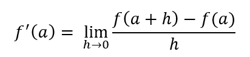
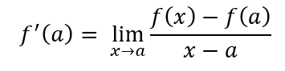
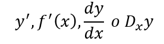
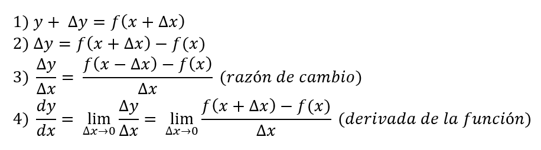
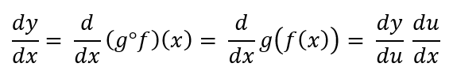
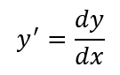
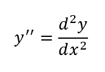
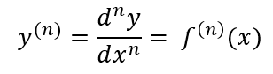

# Diplomado administración, clusterización y analítica de Bases de Datos

## Guía de conceptos básicos de ciencia de datos

## 2. Cálculo Diferencial

### 2.1 Definición de derivada

Sea _f_ una función definida en un intervalo abierto que contiene a _a_. La derivada 
de _f_ en _a_, denotada por _f´(a), está dada por:

Definición alternativa

y se representa por:

#### 2.1.1 Regla de los 4 pasos

Sea una función _y = f(x)_, entonces:

#### 2.1.2 Derivada de una función compuesta (Regla de la cadena)

Sea _y = g(u), u = f(x)_, entonces la derivada de _y = (g ° f)(x) = g(f(x)) se define:

### 2.2 Derivadas de funciones implícitas

Una función implícita se expresa en términos de _x_ y _y_

Ejemplo:

* _sen x = cos(x-y)_
* e^(x+y) = x

Para proceder a derivar una función implícita, se deriva término a término los elementos
de la igualdad con respecto a la variable que se indica, y se despeja la derivada.

### 2.3 Derivadas de orden superior

Sea _y = f(x)_ una función de orden superior, se derivará tantas veces como lo indique
el orden requerido.

La derivada de primer orden está representada por: 

La segunda derivada, es la derivada de la derivada de primer orden, y se denota por:

Al proceso de hallar derivadas, una tras otra, se le denomina derivación sucesiva.

Para calcular la enésima derivada de una función se denota por:

[Bibliografía](bibliografia.md)