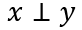

# Diplomado administración, clusterización y analítica de Bases de Datos

## Guía de conceptos básicos de ciencia de datos

## 4. Probabilidad y Estadística

#### 4.1 Probabilidad Condicional

Cuando estamos interesados en la probabilidad de un evento _y_, dado que ocurrió otro evento _x_.
A este evento se le conoce como probabilidad condicional. Denotamos la probabilidad condicional
como _Y = y_ dado _X = x_ como:

La probabilidad condicional está solo definida cuando _P(X = x) > 0_. No se puede calcular la
probabilidad condicional en un evento que nunca pasó.

### 4.2 La regla de la cadena o regla de la multiplicación

Dado una distribución de probabilidad conjunta sobre muchas variables aleatorias puede
descomponerse en distribuciones condicionales sobre una variable, la cual se denota como:

### 4.3 Independencias

Dos variables aleatorias _x_ y _y_ son **independientes** si su distribución de probabilidad
puede ser expresada como un producto de dos factores:

Tambien se puede denotar la independencia de la siguiente forma:

La siguiente notación significa que _x_ y _y_ son condicionalmente independientes dado _z_.

[Bibliografía](bibliografia.md)